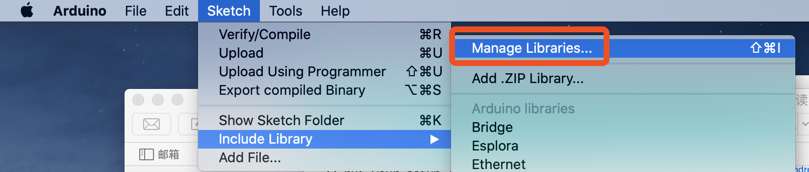
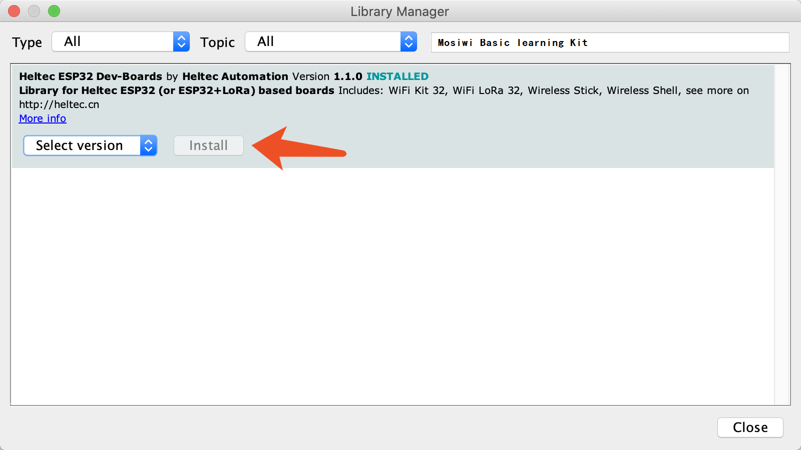

# Mosiwi_Basic_Learning_Kit Library

English | [简体中文](#简体中文)

**This library must work with [Mosiwi Basic Learning Kit](https://github.com/Mosiwi/Mosiwi-basic-learning-kit-for-arduino)! A detail document:**

**[http://mosiwi.com](http://mosiwi.com)**

## CONTENT

1. [How to install this library](#how-to-install-this-library)

	- [Use Arduino Library Manager](#use-arduino-library-manager)

2. [API Reference](#api-reference)

3. [Relevant Resources](#relevant-resources)

***

## How to install this library
*`We recommend using the Arduino library manager, it's the simplest way`*

### Use Arduino Library Manager
Open Arduino IDE, then Select `Sketch`->`Include Library`->`Manage Libraries...`
Search `Mosiwi basic learning kit` and install it.

&nbsp;

## API Reference
[API](src/API.md)

## Relevant Resources

- [wiki](http://wiki.mosiwi.com/index.php/Main_Page)

If there is a "Limited" folder in the resources page, it means the product have limited resources that not public by default, refer to this document to download: [Get Limited Technical Resources](http://mosiwi.com).

&nbsp;
***
***
&nbsp;

## 简体中文

**这个Arduino库必须配合[Mosiwi 基础学习套件](https://github.com/Mosiwi/Mosiwi-basic-learning-kit-for-arduino)一起使用！**

***

## 目录

1. [安装方法](#安装方法)

	- [通过Arduino库管理器安装](#通过Arduino库管理器安装)

2. [API参考](#API参考)

3. [相关资源](#相关资源)

***

## 安装方法
*`强烈推荐使用Arduino自带的“库管理器”进行安装!`*

### 通过Arduino库管理器安装
打开Arduino IDE, 选择`项目`->`加载库`->`管理库...`，打开“库管理器”
搜索`Mosiwi basic learning kit`并安装.

&nbsp;

## API参考
[API](src/API.md)

## 相关资源

- [wiki](http://wiki.mosiwi.com/index.php/Main_Page)

如果在资源下载页中看到了`Limited`文件夹，表明这个产品有非公开的技术资料。[获取受限资源的方法](http://mosiwi.com)

